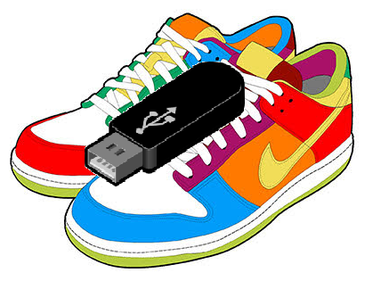

sneakernet
===
when the only connection between two computers is your feet, you need sneakernet.

the computers 
---

One computer is designated the `source`, and that's the computer that you will always copy files **from**.

The other is designated the `destination` (the computer you will always copy files **to**)

making a usb
---

To set up a usb copy the contents of the usb-image folder onto a usb drive.

You'll need to download the [repository](https://github.com/jonathan-annett/sneakernet/archive/refs/heads/main.zip) extract the files, and drag the `sneakernet` folder which is inside the `\sneakernet-main\usb-image` folder, onto the usb drive.

If your usb is drive E, you should end up with a folder "E:\sneakernet".

edit e:\sneakernet\src\settings.ini to define the source and destination folders

These are the folders on each computer that will be synced. By default these should both point to D:\, but if for some reason you want different paths on each computer, here's where you set it.

(note, if you change your mind later, you need to edit the settings.ini file on the desktop of each computer, in the "sneakernet" folder)

Next you need to run a one time script on each computer, which sets up a system wide hotkey to sync the files

setting up the `source` computer
---

Insert the disk into the `source` computer, and open the sneakernet folder, and run "set-this-pc-as-source.cmd", with adminsitrator privilleges

this will create a folder on your desktop called "sneakernet" and a shortcut to a file in that folder

***this script will also disable autorun on insert for all usb drives for that computer.***

you can now press ctrl-alt-s to sync the files in the source folder to the usb drive (they will be in sneakernet/files if you want to inspect them)

setting up the `destination` computer
---

Insert the disk into the `destination` computer, and open the sneakernet folder, and run "set-this-pc-as-destination.cmd", with adminsitrator privilleges

this will create a folder on your desktop called "sneakernet" and a shortcut to a file in that folder

***this script will also disable autorun on insert for all usb drives for that computer.***

ctrl-alt-s on that computer will sync from the usb to the destination folder.

updating changes on the source 
---

If you've added, changed or removed files on the source computer, just repeat the process, and the changes will be copied across.

what if i put in the wrong usb drive?
---

one of the things the set-this-pc-as-xxx scripts do is take a note of the disk's serial number, so it won't attempt to copy to or from a disk that isn't there.
